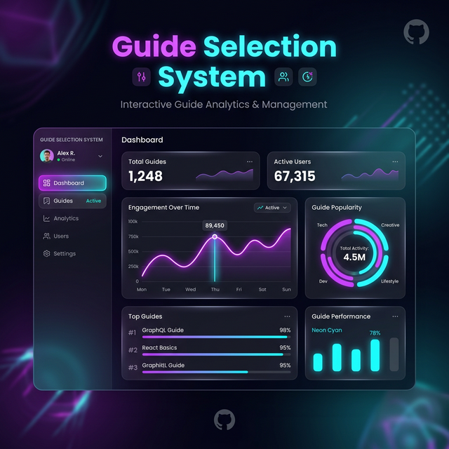

<div align="center">
  
  <br/>
  <h1>🎓 Guide Selection System ("God-Mode" Edition)</h1>
  <p><b>An advanced, AI-powered Full-Stack Web Application for College Faculty-Student Allocation.</b></p>
</div>

---

## ⚡ Overview

The **Guide Selection System** is a premium, enterprise-grade allocation platform designed to automate and streamline the process of matching students to faculty guides for academic projects. It features an incredibly modern dark glassmorphism UI, a 3-Phase mathematical matching engine (Priority Greedy + Gale-Shapley Stable Matching), and advanced "God-Mode" admin capabilities.

### 🌟 Key "God-Mode" Features

*   **🧠 AI-Powered Priority Scoring:** Students upload their SOP (Statement of Purpose) PDFs during registration. The system natively parses the PDF's text and applies an NLP-based keyword matching algorithm against the faculty's research areas to calculate a priority bonus score.
*   **📚 Google Scholar API Integration:** Guides can automatically scrape and synchronize their top 5 recent publications directly from Google Scholar into their profiles.
*   **⚖️ 3-Phase Allocation Engine:** 
    1.  **Phase 1 (Greedy):** Students are allocated based on their calculated "Priority Score" (CGPA + NLP SOP Match + Early Submission Bonus).
    2.  **Phase 2 (Gale-Shapley Stable Match):** Resolves remaining preferences to guarantee that no student-guide pair would both rather have each other over their current matches.
    3.  **Phase 3 (Fallback Pool):** Unmatched students are pooled for the Admin's manual drag-and-drop dashboard.
*   **👑 God-Mode Admin Panel:** Force-assign students, instantly see system-wide metrics via Chart.js analytics, view the global Audit Log, and export complete student allocation data as an `.xlsx` Excel file.
*   **📧 Cloud Notification Simulation:** All major application events (registrations, allocations) trigger email payloads logged as physical `.txt` files simulating an asynchronous microservice (like AWS SES / SendGrid).
*   **🎨 Premium UI/UX:** Built natively with vanilla CSS featuring dynamic CSS variables, backdrop blurs (glassmorphism), neon accents, and responsive flex grids.

---

## 📸 Workflows & Previews

### 1. Student Portal
Students register with their CGPA, upload their SOP PDFs, and lock in their top 3 guide preferences. The dashboard provides a live, interactive timeline of their application status.

### 2. Guide (Faculty) Dashboard
Faculty members enjoy a dedicated applicant tracking system. They can review priority scores, see the NLP Match bonuses, and physically click "Accept", "Reject", or "Waitlist". With Google Scholar integration, their profiles remain effortlessly up to date.

### 3. God-Mode Admin Analytics
The administrator holds complete control. The dashboard features 4 gorgeous radial and bar charts rendering live database statistics (Guide Load, Method Distribution, CGPA vs Priority). 

---

## 🚀 Tech Stack

*   **Backend:** Python 3.12, Flask 3.x
*   **Database:** SQLite via Flask-SQLAlchemy 3.x (SQLAlchemy 2.0 compliant)
*   **Auth & Security:** Flask-Login, bcrypt for password hashing
*   **Frontend:** Vanilla HTML5, state-of-the-art CSS3 (Dark Glassmorphism), minimal Vanilla JS
*   **Advanced Modules:** 
    *   `PyPDF2` (for local SOP NLP parsing)
    *   `scholarly` (for Google Scholar scraping)
    *   `Flask-Mail` (for email service simulation)
    *   `openpyxl` (for Excel exports)

---

## 🛠️ Installation & Local Setup

1. **Clone the repository:**
   ```bash
   git clone https://github.com/imshivanshutiwari/Guide-selection.git
   cd Guide-selection
   ```

2. **Create a virtual environment (optional but recommended):**
   ```bash
   python -m venv .venv
   .venv\Scripts\activate  # Windows
   # source .venv/bin/activate  # Mac/Linux
   ```

3. **Install Dependencies:**
   ```bash
   pip install -r requirements.txt
   ```

4. **Initialize & Seed the Database:**
   We have included a powerful seed script that completely resets the database and injects **20 Students, 5 Guides, and 15 simulated preferences** for instant testing.
   ```bash
   python seed_data.py
   ```

5. **Run the Application:**
   ```bash
   python app.py
   ```
   Navigate to `http://127.0.0.1:5000` in your web browser.

---

## 🔐 Default Demo Accounts
If you ran `seed_data.py`, use these credentials to instantly access the different portals:

| Role | Email | Password |
| :--- | :--- | :--- |
| **Admin** | `admin@college.edu` | `admin123` |
| **Guide** | `dr.sharma@college.edu` | `guide123` |
| **Student** | `rahul@student.edu` | `student123` |

---

## 📁 Project Structure highlights
*   `app.py`: The monolithic core containing all routes, email configs, and auth logic.
*   `matching.py`: The mathematical brain executing the 3-Phase Allocation algorithms.
*   `models.py`: Database schema definitions (User, Student, Guide, Preference, Allocation, Notification, AuditLog).
*   `static/style.css`: 800+ lines of custom CSS framework powering the glassmorphic aesthetics.
*   `templates/`: Jinja2 inheritance architecture isolating dashboards by role.

---
*Built as a state-of-the-art academic modeling and simulation implementation.*
